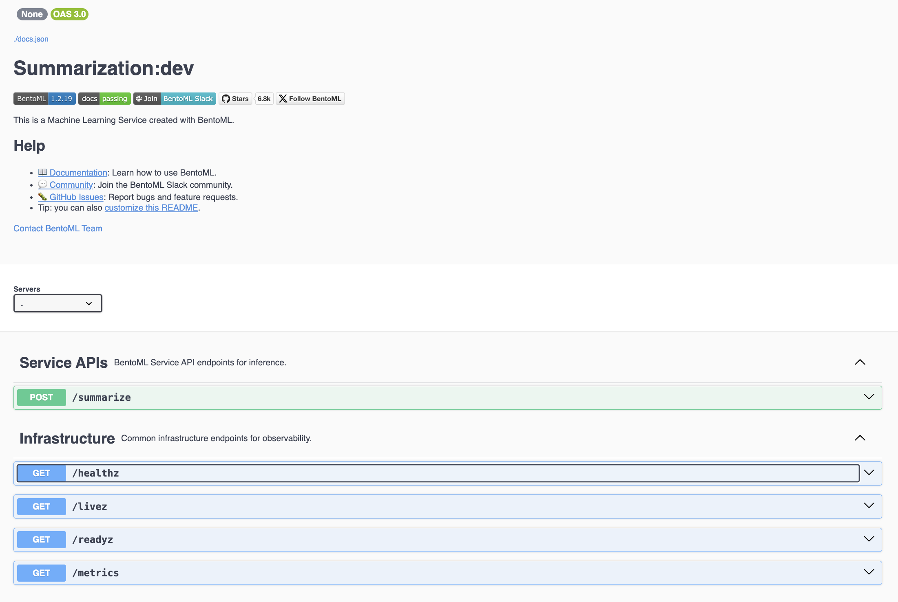
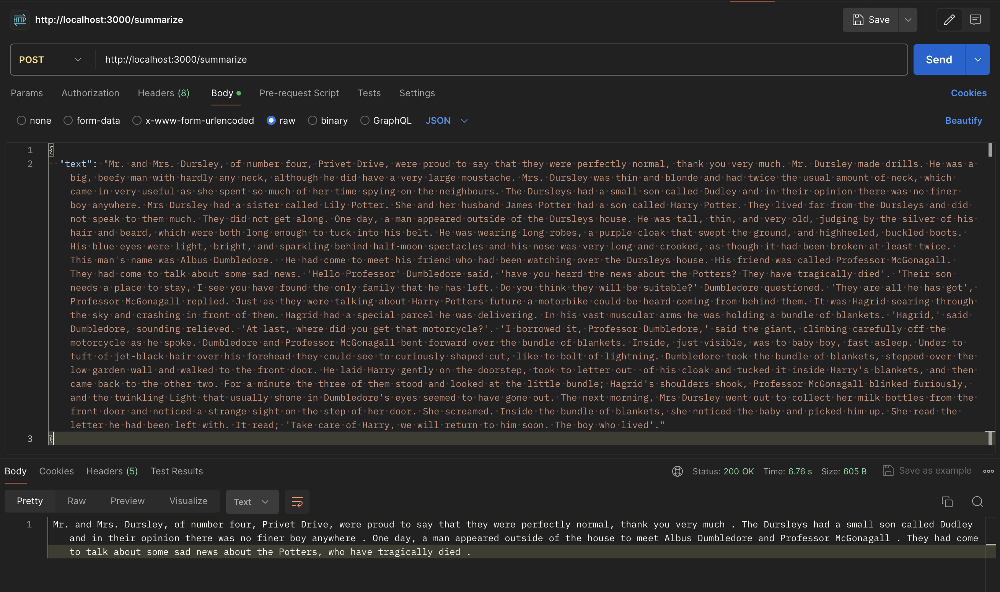

# BentoML to Play with Hugging Face Transformer Models

Based on:
* https://docs.bentoml.com/en/latest/get-started/quickstart.html

---

## What are the Components of This Open-Source Sorcery?

Here's all that's in `requirements.txt`:

```
bentoml
torch
transformers
```

To my understanding:
* `bentoml` (**BentoML**) is a framework for serving models as HTTP endpoints.
  * It, like FastAPI, has data-validation niceties built into it via **Pydantic**.
* `torch` (**PyTorch**) is a framework for building deep learning models.
* `transformers`  is **Hugging Face**'s library that provides APIs for common NLP tasks (including text, image, and audio).
  * This specific app uses the `transformers.pipeline` API.
    * `pipeline` is a high-level abstraction that makes it easy to use a number of common models.
    * `pipeline("summarization")` instantiates a [SummarizationPipeline](https://huggingface.co/docs/transformers/v4.41.3/en/main_classes/pipelines#transformers.SummarizationPipeline).

---

## Create and Instantiate a Virtual Environment:

From [here](https://packaging.python.org/en/latest/guides/installing-using-pip-and-virtual-environments/).

Because I always forget how this works...

#### Create:

* `python3 -m venv .venv`
  * `-m venv` = use the `venv` module
  * `.venv` = the name of the virtual environment folder

### Instantiate:

* `source .venv/bin/activate`

#### Verify:

* `which python`
  * should output `/Users/..../.venv/bin/python`

#### Deactivate:

* `deactivate`

---

## Install the Dependencies Specified by `requirements.txt`:

* `pip install -r requirements.txt`
  * `-r` just means "install stuff from a requirements file."

---

## Use BentoML to Serve the Model as an HTTP Server:

* `bentoml serve service:Summarization`
  * This instantiates a BentoML service on `localhost:3000`.

---

## Open `localhost:3000` in Your Browser 😱:

It's beautiful. OpenAPI for free!


---

## Hit the `/summarize` Endpoint w/ Postman:



---

## Deployment Options:

* Automagically deploy a "Bento" to [BentoCloud](https://www.bentoml.com/cloud)
  * As long as you're [logged-in](https://docs.bentoml.com/en/latest/bentocloud/how-tos/manage-access-token.html), this is as simple as:
    * `bentoml deploy`
* Make your own "Bento" via [Docker containerization](https://docs.bentoml.com/en/latest/guides/containerization.html).
  * Then, deploy it anywhere that's compatible with Dockerized stuff.
